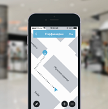

 

About Navigine Indoor Location Services
=======================================

Navigine Indoor Location Services is a set of unified tools for indoor
marketing, analysis, and tracking purposes. The tools' application scope
includes (and is not limited to) airports, shopping malls, universities,
and so on.

The Navigine's Indoor Location Services include:

+-----------------------------+-----------------------------+------------------------------+-----------------------------+
| Navigine Indoor             | Navigine Marketing          | Navigine Analytics           | Navigine Tracking           |
+-----------------------------+-----------------------------+------------------------------+-----------------------------+
| |image0|                    | |image1|                    | |image2|                     | |image3|                    |
+-----------------------------+-----------------------------+------------------------------+-----------------------------+
| | Navigine Indoor allows to | | Navigine Marketing is the | | Navigine Analytics enables | | Navigine Tracking enables |
| | implement navigation      | | tool for quick            | | to analyze objects motion  | | tracking motion of staff  |
| | inside any building with  | | embedding indoor          | | inside building in real    | | vehicles, and other assets|
| | up to 1 meter accuracy    | | push-notifications        | | time                       |                             |
|                             | | into mobile apps          |                              |                             |
+-----------------------------+-----------------------------+------------------------------+-----------------------------+

 

+--------------------------------+--------------------------------------------------------------+
| .. rubric:: NAVIGINE INDOOR    | | Navigation platform Navigine enables mobile developers     |
| | Accurate navigation          | | to create a wide range of services on the basis of high    |
| | inside any building          | | accurate indoor navigation. Mobile applications powered    |
|                                | | by Navigine Indoor helps visitors to easily navigate       |
|                                | | inside large buildings and building owners to monitor      |
|                                | | and manage their employees motion. In order to guarantee   |
|                                | | high accuracy navigation technology uses external          |
|                                | | infrastructure – iBeacon/Wi-Fi as well as internal         |
|                                | | smartphone sensors – accelerometers, gyroscopes,           |
|                                | | barometer, compass and also leverage map features and      |
|                                | | human motion model. Functions of Navigine Indoor are       |
|                                | | quickly and easily integrated into any mobile application  |
|                                | | using API/SDK Navigine. Proven Navigine approach allows    |
|                                | | to roll out navigation service on 50000 sq. m. per one     |
|                                | | day by one employee. You may evaluate service performance  |
|                                | | by ordering our Developer Kit.                             |
+--------------------------------+--------------------------------------------------------------+
| .. rubric:: NAVIGINE MARKETING | | Marketing platform Navigine is the tool to create and      |
|                                | | manage indoor push notifications in mobile applications    |
| | Indoor location              | | on the basis of iBeacon technology. Using this platform    |
| | advertisement                | | mobile developers may significantly improve customer       |
| | in mobile apps               | | experience and monetization of mobile apps as well as      |
|                                | | advertisers may leverage additional marketing channel.     |
|                                | | As for technology our marketing platform uses Bluetooth    |
|                                | | Low Energy (Bluetooth 4.0) protocol. Requirements for      |
|                                | | platform operations are availability of Bluetooth 4.0 on   |
|                                | | mobile devices and installed Bluetooth beacons in zones    |
|                                | | where push notifications are needed Functions of Navigine  |
|                                | | Marketing are integrated into mobile applications using    |
|                                | | API/SDK. In order to create and manage notifications       |
|                                | | developers receive an access to special web interface.     |
+--------------------------------+--------------------------------------------------------------+
| .. rubric:: NAVIGINE ANALYTICS | | Allows building owners to analyze motion of visitors       |
|                                | | and staff inside their buildings. Services on the basis    |
| | Comprehensive indoor         | | of Navigine Analytics helps to build motion heat maps and  |
| | location analytics           | | optimize marketing channels.                               |
+--------------------------------+--------------------------------------------------------------+
| .. rubric:: NAVIGINE TRACKING  | | Allows building owners to track the motion of staff,       |
|                                | | vehicles and other assets on the building’s premises.      |
| | Real time indoor             | | IT solutions using Navigine Tracking help to track         |
| | tracking services            | | object's indoor movements in real time and optimize        |
|                                | | logistics business processes.                             |
+--------------------------------+--------------------------------------------------------------+

 

 

.. |image2| image:: _static/analyt_for_prod.png

