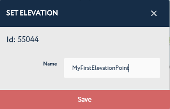
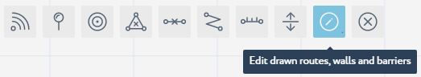

 

Add Routes
==========

In the seventh step of the getting started with Navigine Indoor Location
Services, you add routes to your sub-location's map. The Navigine SDK
enables you to add routes from the current position to any reachable
place in the map.

The Navigine CMS provides two routing tools: Draw Route and Add
Elevation Point to Route. Make sure that the Routes layer is active in
the Layers menu.

+--------------------------------------------------------------------------------------------------------------------------------------------+------------+
| You can choose the layers that you want to be available with the currently open sub-location. To do so,                                    | |image0|   |
|                                                                                                                                            |            |
| #. Activate the Layers drop-down menu,                                                                                                     |            |
| #. Click the Blue Field next to a layer's name. Blue background means that the layer is active, gray means that the layer is not active.   |            |
+--------------------------------------------------------------------------------------------------------------------------------------------+------------+

 

Adding Routes
-------------

You can add routes according to the guidelines described in the table
below.

+------------------------------------------------------------------------------------------------------------------------------------------------------+------------+
| In the sub-location editing window, activate the Add Routes tool.                                                                                    | |image1|   |
+------------------------------------------------------------------------------------------------------------------------------------------------------+------------+
| Click the sub-location's map add vertices and demarcate the route. Once you add the last vertex, double-click the map to add the route to the map.   | |image2|   |
+------------------------------------------------------------------------------------------------------------------------------------------------------+------------+

Adding Elevations
-----------------

--------------

To connect routes of different sub-locations, you need to add
elevations. The following table provides guidelines on using the Add
Elevation tool.

+--------------------------------------------------------------------------------------------------------------------------------------------------------------------------------------------------+------------+
| Release all tools to be able to add elevation points. TO deactivate the active tool, click its button.                                                                                           | |image3|   |
+--------------------------------------------------------------------------------------------------------------------------------------------------------------------------------------------------+------------+
| Click the vertex that you want to make the elevation point, then enter its name in the popped-up dialog box, and click Save. Do it for at least to vertices on two separate sub-location maps.   | |image4|   |
+--------------------------------------------------------------------------------------------------------------------------------------------------------------------------------------------------+------------+
| Once you finish setting elevation points, activate the Add Elevation tool.                                                                                                                       | |image5|   |
+--------------------------------------------------------------------------------------------------------------------------------------------------------------------------------------------------+------------+
| In the Elevation mode, click the elevation points of your choice to connect the routes they represent. To end drawing connections, double-click the last point.                                  | |image6|   |
+--------------------------------------------------------------------------------------------------------------------------------------------------------------------------------------------------+------------+

 

At any moment of object creation in the sub-location's map, you can use
the Edit drawn routes, walls, and barriers tool.

+--------------------------------------------------------------------------------------------------------+------------+
| In the sub-location editing window, activate the Edit tool.                                            | |image7|   |
+--------------------------------------------------------------------------------------------------------+------------+
| Click the drawn object's vertex with the Edit tool activated, and move the vertex to a new position.   | |image8|   |
+--------------------------------------------------------------------------------------------------------+------------+

 

.. |image0| image:: _static/selecting-layers.png
.. |image1| image:: _static/add_route.png
.. |image2| image:: _static/routes.png
.. |image3| image:: _static/no-active-tools.png

.. |image5| image:: _static/add-elevation.png
.. |image6| image:: _static/elevation_mode.png

.. |image8| image:: _static/edit-drawn-action.png
