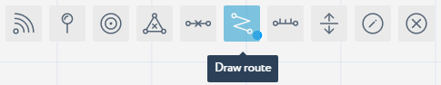
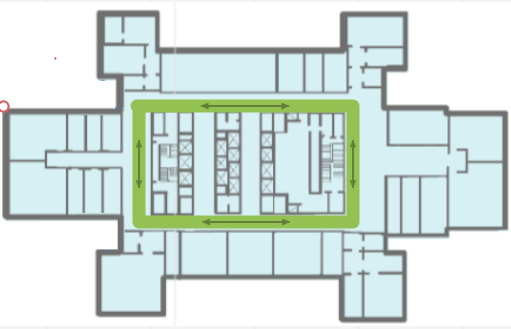

Adding Paths
============

Add paths to your sub-location's map. The Navigine SDK enables you to add paths from the current position to any reachable place in the map.

The Navigine CMS provides two path-finding tools: **Draw Route** and **Add Elevation Point to Route**. Make sure that the **Routes** layer is active in the **Layers** menu.
 

Adding Routes
-------------

You can add routes according to the following guidelines:

#. In the sub-location editing window, activate the **Add Routes** tool.

	* |image1|

#. Click the sub-location's map add vertices and demarcate the route. Once you add the last vertex, double-click the map to add the route to the map.

	* |image2|

Adding Elevations
-----------------

To connect routes of different sub-locations, you need to add
elevations. Consider the following guidelines:

#. Release all tools to be able to add elevation points. To deactivate the active tool, click its button.

	* |image3|

#. Click the vertex that you want to make the elevation point, then enter its name in the popped-up dialog box, and click **Save**. Do it for at least two vertices on two separate sub-location maps.

	* |image4|

#. Once you finish setting elevation points, activate the **Add Elevation** tool.

	* |image5|

#. In the **Elevation** mode, click the elevation points of your choice to connect the routes they represent. To end drawing connections, double-click the last point.

	* |image6|

.. |image0| image:: _static/selecting-layers.png

.. |image3| image:: _static/no-active-tools.png
.. |image4| image:: _static/elevation_point.png
.. |image5| image:: _static/add-elevation.png
.. |image6| image:: _static/elevation_mode.png