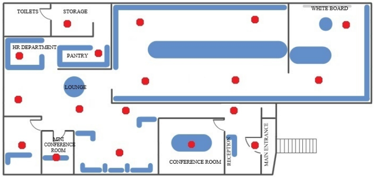

Setting Up iBeacon Infrastructure
=================================

The following section provides guidelines on setting up the iBeacon infrastructure for your indoor navigation app.

Configuring Beacons
-------------------

Prior to installing beacons in the target locations, you need to configure them. Use the Navigine's and Kontact.io applications for beacon configuration.
The applications are available at <TBD>

.. raw:: html

   

Make sure that the beacons are in iBeacon mode and the signal transmit power is set to\ `` -4dbm``.

.. raw:: html

   

By default the Kontact.io beacons are set to travel mode and have minimal transmit power for power saving purposes. In the beacon transmit power options choose the 5th value, which corresponds to ``-4dbm``.

Deploying Beacons
-----------------

Take into account the following golden rules during the beacon
installation procedure:

-  Use the beacons only in the areas where navigation is required.
-  Install the beacons above the head level at the height between 2 and
   4 meters. The best practice is to fasten beacons on the ceiling.
-  In the case when the recommended beacon installation place is
   unavailable (for example, the ceiling is too high), you can attach
   the beacons to the walls.
-  Use 1 beacon for the locations smaller than 25 square meters.
-  Place the beacons evenly across the location, still do not put them
   on the same direct line.
-  The more beacons you use, the higher the accuracy level is. Consider
   using 8-15 beacons per 1000 square meters.
-  DO NOT put beacons behind metal objects and/or any other obstacles,
   otherwise the beacon's usefulness will be tending to zero.
-  Make sure the beacons are inaccessible so that they cannot be moved
   by unauthorized people.

The following figure demonstrates the optimal settlement of 18 beacons
for a single facility with multiple rooms inside.

|image0|

