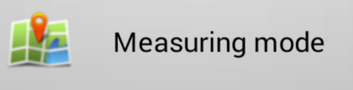
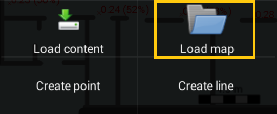
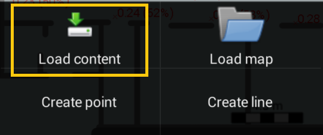
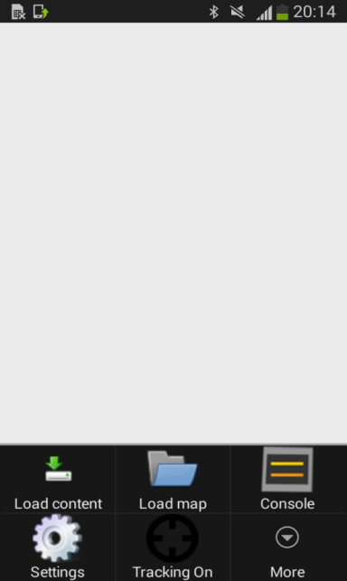
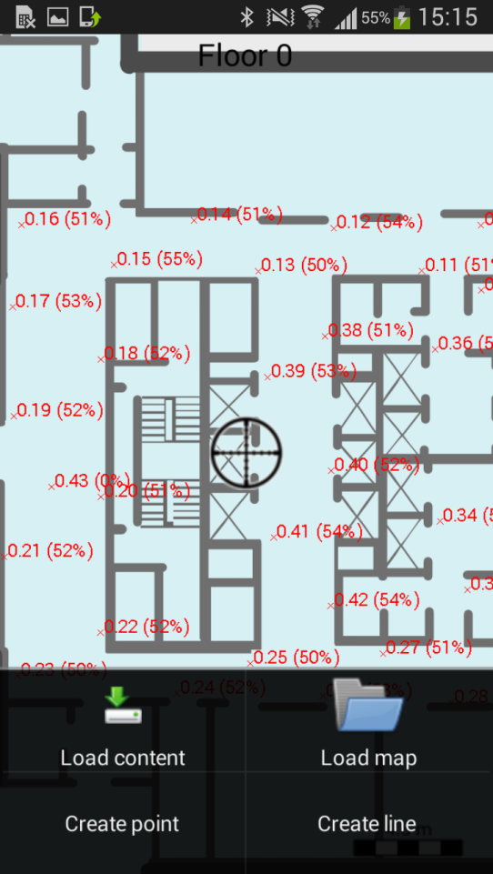
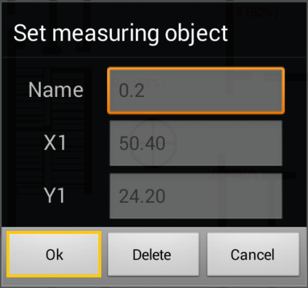

Measuring Radiomap
==================

The Radiomap Measurement approach is actually measuring the target location's radiomap on foot via an Android device with the Navigine's Demo app installed.

By this moment you should have `infrastructure deployed <gs_setup_infrastructure.html>`__ and `maps (locations) implemented <gs_create_map.html>`__,.

Installing the Demo App
-----------------------

You need the Android Demo App installed on your Android device first. To get it,

#. Install the Navigine's Demo App for Android from `GitHub repository <https://github.com/Navigine/Android-SDK/tree/master/Navigine>`__. You can also the app sources there to build it yourself.
#. Switch on the Android device's Wi-Fi and Bluetooth modules.

Installing the Map
------------------

Prior to measuring the radio map, you need to download and install the map you've `created in the Navigine's CMS beforehand <gs_create_map.html>`__.

#. Run the Demo App.
#. Tab on the **Measuring mode**. 

	* |image0|
   
#. Select **Load Content**.

	* |image3|

#. In the **Load Content** dialog, put checkmark next to **Forced load**, enter name of your `location <cm_creating_location.html>`__,and wait for the download to complete.

	* |image2|

#. Go back to the **Settings** menu and select **Load map**. 

	* |image1|

#. After your file manager opens, find the folder with your location's name, and open the map ZIP archive. Your location's map should appear.

	* |image5|

Measuring the Radio Map 
-----------------------

To measure the radio map of the target location, you need to do the following:

#. In the Demo App, specify your current physical location via the aim mark symbol on the map.

	* |image6|

#. Tap the **Function** button, and tab **Create point**. In the **Set measuring object** dialog tap **Ok**.

	* |image7|

#. Wait for the % indicator in the top part of the screen to reach 100% for the currently measured reference point, which should take around one minute. 

#. Repeat the measurement process until you create enough reference points.

Measurement Recommendations
---------------------------

* Map measurement process is indicated in percentage in the upper part of the Android device's screen. 100% means that the application gathered enough information for effective navigation. Normally the process takes about one minute.
* In the case when radiomap measurement process takes longer than one minute (you see that the % indicator got stuck), do the following:

	* Check your devices Wi-Fi and Bluetooth modules' status
	* If the modules are active, go back to the **Main menu**, select **Navigation mode**, push the **Function** button, and tap on **Console** to see the list of the currently available Wi-Fi and Bluetooth emitters. In the case when the amount of emitters is too low, consider increasing the power of the existing beacon’s transmit signal, or add more emitters into the infrastructure.
	
* In the case when the gathered radiodata is broken or incomplete, consider re-gathering. Prior to gathering the data once again, remove the existing reference point via tapping its red crest symbol in the map and then tapping **Delete**.
* If the current master location contains more than one sub-locations, you have to measure radiomaps of all sub-locations, otherwise navigation will not work.

Also consider the following "golder rules" when measuring radiomaps:

* Reference points should cover the target location evenly.
* Add some points near the location's borders and passageways, which should help the application to determine the location's geometry and increase navigation accuracy.
* Do not change the device's position, as it might distort the radiomap and decrease the navigation accuracy.
* Also consider turning away from the nearby walls to avoid the gathered information distortion.
 

.. |image2| image:: _static/android_app_forced.png
			:scale: 50 %

.. |image6| image:: _static/android_app_aim_mark.png
			:scale: 50 %
