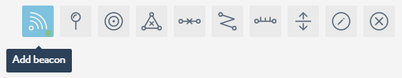
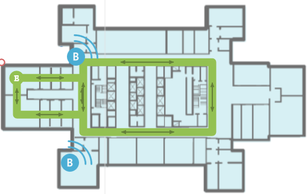

Using Trilateration
===================

In case when you select `iBeacon configuration <is_ibeacon_configuration.html>`__ for your indoor location infrastructure, you can use the Trilateration algorithm to map data from the iBeacons to your location (map).

To do so, 

#. `Log into Navigine's CMS <http://client.navigine.com/login>`__.
#. Switch to the **Locations** tab, select your target location, and sub-location.
#. Activate the **Add beacon** tool.

	* |image0|

#. In the **ADD BEACON** dialog, specify the beacon's parameters:

	* **Description** - you can add beacon's name here.
	* **UUID** - specify the unique name of the iBeacon
	* **Major** - beacon major identifier
	* **Minor** - beacon minor identifier
	* **RSSI per meter** - measurement of the power present in a received radio signal
	
#. Click **Add**. The beacon's icon should appear in the map. 

	* |image1|

#. Repeat steps 3 and 4 for all beacons you've deployed in the target location.
#. Click **Save**.

That's it. The iBeacon infrastructure is deployed and configured, you can start working on the indoor navigation app.

