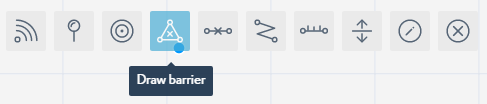

 

Populate Sub-location with Obstacles
====================================

In the sixths step of the getting started with Navigine Indoor Location
Services, you add map physical obstacles to the sub-location in the
Navigine Content Management System (CMS). Measure the sub-location to
make the obstacles drawing tools available.

The Navigine CMS provides two obstacle drawing tools, which are Barriers
and Walls. Make sure the corresponding layers are active in the Layers
menu.

You can choose the layers that you want to be available with the currently open sub-location. To do so,

#. Activate the Layers drop-down menu,
#. Click the Blue Field next to a layer's name. Blue background means that the layer is active, gray means that the layer is not active.

|image0|
 

Adding Barriers (Zones)
-----------------------

Barriers are the zones where a person can’t reach, for example: closed
rooms, or areas outside the building. To add obstacles of such kind into
your sub-location's map, follow the guidelines in the table below.

In the sub-location editing window, activate the Barriers tool.

|image1|

Click the sub-location's map to add vertices that demarcate the barriers. Once you add the last barrier vertex, either double-click the map, or click the first vertex to add the barrier's closed contour to the map.

|image2|

Adding Walls
------------

Setting walls is similar to setting the barriers. The only difference is
that you need to separate the walls in the places where doorways should
be. To add obstacles of such kind into your sub-location's map, follow
the guidelines in the table below.

In the sub-location editing window, activate the Walls tool.

|image3|

Click the sub-location's map to add vertices that demarcate the walls. Once you add the last wall vertex, either double-click the map, or click the first vertex to end the wall and add it to the map.

|image4|

At any moment of object creation in the sub-location's map, you can use
the Edit drawn routes, walls, and barriers tool.

In the sub-location editing window, activate the Edit tool.

|image5|

Click the drawn object's vertex with the Edit tool activated, and move the vertex to a new position.

|image6|
 

--------------

Once you're done adding the obstacles, go to `Add
Routes <add_routes.htm>`__.

 

.. |image0| image:: _static/selecting-layers.png

.. |image3| image:: _static/add-walls.png

.. |image5| image:: _static/edit-drawn.png
.. |image6| image:: _static/edit-drawn-action.png
