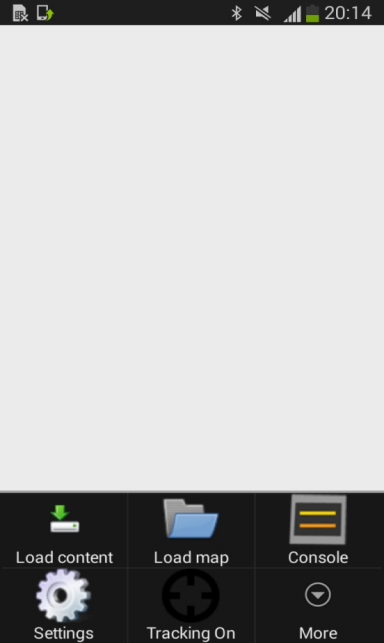

 

Step 4. Measuring the Radiomap
==============================

In the forth step of getting started with Navigine Indoor Location
Services, you measure the target location's radiomap. By this moment you
should have the infrastructure already deployed and the location map
created.

The following is the list of steps you need to take to measure your
location's radiomap:

+--------------------------------------------------------------------------------------------------------------------------------------------------------------------------------------------------------------------------+------------+
| #. Install the ``Navigine.apk`` on the device from the `Navigine website <http://client.navigine.com/manual/Navigine-debug.apk(v.).apk>`__                                                                               | |image0|   |
| #. Turn on Bluetooth and Wi-Fi modules of your device.                                                                                                                                                                   |            |
| #. Run the Navigine application, and select the Measuring mode.                                                                                                                                                          |            |
| #. Open the Settings menu, and then select Load Content.                                                                                                                                                                 |            |
| #. In the Load Content dialog, enter the name of your location (see `Create Locations <create_location.htm>`__), your registration user ID, then select Force Reload.                                                    |            |
| #. Go back to the Settings menu and select Load Map.                                                                                                                                                                     |            |
| #. Your file manager opens, now find the folder with your location's name, and open the map ZIP archive.                                                                                                                 |            |
| #. Check the beacons' availability by going to Settings menu and selecting Console.                                                                                                                                      |            |
| #. <TBD>                                                                                                                                                                                                                 |            |
| #. In the Settings menu, select More, select Create the control point, and then select OK. This way you create a Reference Point (RP). Wait for the Start button to appear in the top of the screen.                     |            |
| #. Press the Start button and wait motionless for the Quality indicator to reach 70%, then press Stop.                                                                                                                   |            |
| #. Choose the next point on the map and repeat steps 10 and 11. Do it for each of the Reference Points.                                                                                                                  |            |
| #. Once finished with measuring the radiomap, upload it to the Navigine server: open the Setting menu, select Load Content, then fill in the location name, and select Upload. The Force reload tick must be unmarked.   |            |
|                                                                                                                                                                                                                          |            |
|                                                                                                                                                                                                                          |            |
|                                                                                                                                                                                                                          |            |
|                                                                                                                                                                                                                          |            |
+--------------------------------------------------------------------------------------------------------------------------------------------------------------------------------------------------------------------------+------------+

 

--------------

Now you should be ready to test the your navigation system in demo mode.

 

