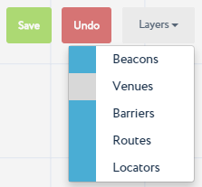

Locations Tab
=============

Layers
------

You can choose the layers that you want to be available with the currently open sub-location. To do so,

#. Activate the Layers drop-down menu,
#. Click the Blue Field next to a layer's name. Blue background means that the layer is active, gray means that the layer is not active.

|image4|

Editing Tool
------------

At any moment of object creation in the sub-location's map, you can use
the **Edit drawn routes, walls, and barriers** tool.

In the sub-location editing window, activate the **Edit** tool.

|image5|

Click the drawn object's vertex with the Edit tool activated, and move the vertex to a new position.

|image6|

.. |image5| image:: _static/edit-drawn.png
.. |image6| image:: _static/edit-drawn-action.png
